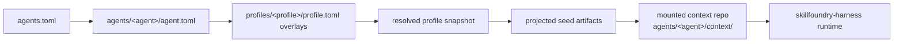

# skillfoundry-agents

Coordination hub for agent manifests, profiles, topology, and mounted context lineages.

## At a glance

This repo is the workspace hub for Skillfoundry agents. It is narrow on purpose:

- Agent registry and topology (`agents.toml`, `agents/<agent>/agent.toml`).
- Profile resolution with deterministic overlays (`profiles/<profile>/profile.toml`).
- Context mount conventions (`agents/<agent>/context/` as a checkout of each agent's context lineage).
- Light workspace coherence validation.
- Projection of resolved profiles into seed artifacts that land in the mounted context repo.

What this repo is **not**:

- Not the runtime. Execution semantics live in `skillfoundry-harness`.
- Not the canonical memory layer. Evolving agent state lives in each agent's context lineage.
- Not a schema owner for context objects. The context repository substrate defines those.

## Why this repo is separate from the harness

The harness changes when the runtime changes. The hub changes when the *shape* of the
organization changes: which agents exist, which profiles they inherit, where their
context mounts. Keeping these separate means swapping the harness does not disturb
the agent registry, and reshaping the org does not disturb runtime code.

## Workspace model

| File | Role |
| --- | --- |
| `agents.toml` | Workspace index. Lists agents, defaults, and which harness/context-repo config applies. |
| `agents/<agent>/agent.toml` | Source of truth for a single agent: id, role, status, profile stack, projection targets. |
| `profiles/<profile>/profile.toml` | Reusable role overlay. Profiles may `extend` other profiles; resolution is deterministic. |
| `agents/<agent>/context/` | Mount point for the agent's context lineage checkout. Transport (clone / worktree / submodule) is not fixed; the path is. |

The `runtime.profiles` list in an agent manifest is resolved against the profile
directory to produce a merged snapshot. That snapshot is then *projected* into
concrete seed artifacts inside the mounted context repo.

## Flow



## Quick validation

Only commands below are known to work against the current layout:

```bash
# Check that agents.toml, agent manifests, and profile overlays are coherent.
python3.12 scripts/check_workspace.py

# Resolve a single agent's profile stack into a merged snapshot.
python3.12 scripts/resolve_profiles.py agents/researcher/agent.toml

# Project a resolved agent into seed artifacts inside a mounted context repo.
python3.12 scripts/project_agent.py agents/researcher/agent.toml /path/to/context-repo

# Run the workspace validation tests.
python3.12 -m unittest discover -s tests
```

## Relationship to skillfoundry-harness

- **This repo (hub):** who the agents are, where they live, what shape they take.
- **skillfoundry-harness:** how execution happens — runtime semantics, scheduling, tool wiring.

The hub hands the harness a resolved agent definition and a mounted context path.
The harness owns everything that happens after that.

## Source of truth for evolving state

The hub does not hold durable agent memory. Each agent's context lineage (checked
out under `agents/<agent>/context/`) remains the source of truth for evolving
state, bundles, artifacts, and runs. The hub only projects initial seed
artifacts; the lineage carries history forward.

## Default operating stack (workspace-specific)

The Skillfoundry workspace currently configures these long-lived agent roles.
This is a workspace-specific configuration, not a universal ontology — other
workspaces on the same substrate would declare different roles.

- `researcher`
- `builder`
- `designer`
- `pricing`
- `growth`
- `valuation`

## How this fits into the broader system

- **`context-repository`** — Abstract substrate: object model, memory classes,
  reentry, epistemic loop. The hub conforms to its contracts.
- **`skillfoundry-agents`** (this repo) — Workspace hub: agent registry,
  profiles, topology, projection.
- **`skillfoundry-harness`** — Runtime: executes against mounted context
  lineages using hub-resolved agent definitions.
- **Per-agent context lineages** — Canonical evolving state for each agent.
- **Product repos** — Downstream outputs produced by the agent system.

## Suggested GitHub metadata

- **Description:** Coordination hub for agent manifests, profiles, topology, and mounted context lineages.
- **Topics:** `skillfoundry`, `agents`, `agent-registry`, `profiles`, `workspace`, `context-repo`, `topology`, `coordination-hub`, `multi-agent`
